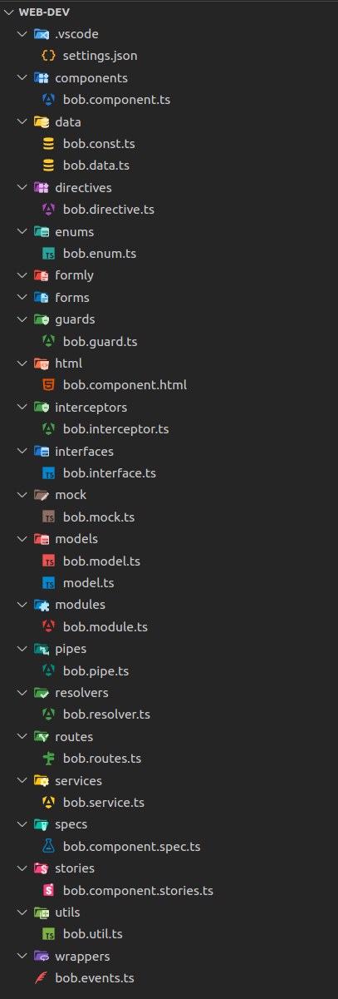
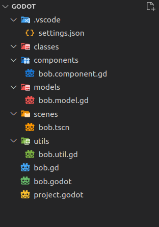

# [Material Icon Theme](https://github.com/material-extensions) Settings in [VSCode](https://code.visualstudio.com/) 
Settings for custom folders/files for various projects
Such as Web Dev/Angular or Godot Game Dev

To get the colors and icons for your project copy the `.vscode/settings.json` from respective folder for your project 

The rest of the folders/files are for visual testing purposes

## Support Me

If you find the extension or the source code useful, consider:

- Donating on Ko-fi: https://ko-fi.com/deniszholob
- Donating on Patreon: https://www.patreon.com/deniszholob

# Settings

**[WebDev/Angular](./web-dev/.vscode/settings.json)**  

**[Godot](./godot/.vscode/settings.json)**  

## Reference

* Icons Image:  
https://github.com/material-extensions/vscode-material-icon-theme/blob/main/README.md#file-icons
* Icons Definitions:  
https://github.com/material-extensions/vscode-material-icon-theme/blob/main/src/core/icons/fileIcons.ts#L9
* Colors:  
https://github.com/material-extensions/vscode-material-icon-theme/blob/main/src/core/generator/clones/utils/color/materialPalette.ts#L4

